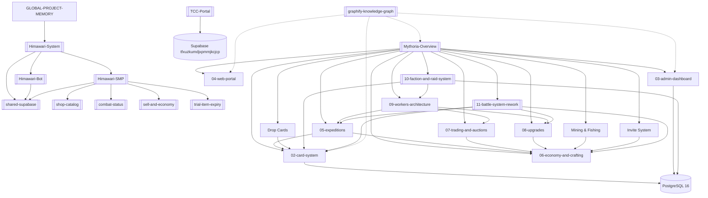

# GLOBAL PROJECT MEMORY

Global source of truth and index for the SecondaryBrain. Everyday loop: read this → read the
matching project cluster → reuse documented patterns → update after meaningful changes. Full
"deep mode" ceremony lives in `_System/reference-architecture-protocol.md`.

## Project clusters

### Himawari (Bot + Mod + shared DB)
The WopsSMP system: the bot and mod join via **one shared Supabase project** ("Mod",
`tdmzxxyctqnxxkdulvar`). Top hub: [[Himawari-System]]. **As of 2026-06-24 the `Himawari` git repo is
mod-only** — cleaned, flattened to root, and published fresh at **github.com/Woopsyyy/Himawari**
(see timeline). The bot lives/deploys separately.
- [[Himawari-Bot]] — Discord bot (Node.js / discord.js 14), deploys to Discloud.
- [[Himawari-SMP]] — Fabric Minecraft mod (`com.survivalmod`, MC 26.2, Java 25); built from WSL,
  `deployToMods` auto-copies the jar to `D:\Minecraft Server\HimawariSMP_1\mods`. Repo:
  github.com/Woopsyyy/Himawari (`minecraft` dep loosened to `>=26.2-` — no version guard rail).
- [[shared-supabase]] — the bridge: linking, mod live-config, backups, bot ticket/embed tables.
Feature nodes: [[shop-catalog]], [[combat-status]], [[sell-and-economy]], [[trial-item-expiry]],
[[auction-marketplace]], [[moderation-bans]], [[admin-investigator]], [[bounties]], [[audit-log]].

### NewBaritone (Baritone pathfinding client mod)
Standalone Fabric **MC 26.2 / Java 25** client mod — fork of cabaletta/baritone. Top node:
[[NewBaritone]]. Built from WSL (same toolchain pattern as [[Himawari-SMP]]: LF gradlew, WSL-only
builds, `deployToMods` → `.minecraft/mods`). MC 26.x is unobfuscated, so no mappings/remap.

### TCC Portal (school management SPA)
Talisay City College portal: **client-only Vite + React 19 (TS) SPA on Vercel**, backed **directly by
Supabase** (anon key in browser) + 4 Edge Functions — **no backend server**, so **RLS + RPC grants are
the whole security perimeter**. Top node: [[TCC-Portal]]. Supabase ref `tfxuzkumdjxpmmjkcjcp`
(separate account from [[shared-supabase]]); local and prod share one DB. Roles: admin/teacher/office/
student. Node runs in WSL via nvm; build with `vite build`.

### Mythoria (Discord RPG — Bot + Web)
Medieval fantasy Discord RPG with card collection, trading, auctions, expeditions, and a web dashboard. Two packages in one repo: **MythoriaBot/** (Node.js + TypeScript + discord.js v14 + BullMQ workers) and **MythoriaWeb/** (Vite + React 18 + Tailwind CSS v4). Top hub: [[Mythoria-Overview]].

**Hosting:** Fully local Docker stack — bot (`node:22-alpine`), PostgreSQL 16, Redis 7, Nginx (assets). No cloud dependencies.

**Bot services:** [[02-card-system]] — stat engine, mint/disassemble/merge, image gen; [[03-admin-dashboard]] — owner-only card import + Express dashboard; [[05-expeditions]] — tick-based auto-dungeon (600 floors, 30 regions, red gates), turn-based battle; [[06-economy-and-crafting]] — coins/essence, 8 material families (48 items), 3 gear sets (18 items), pickaxes/rods (12 items), 80+ crafting recipes, daily/weekly/monthly claims, invite bonuses; [[07-trading-and-auctions]] — peer-to-peer trades + full auction house; [[08-upgrades]] — 9-tier quality ladder with celestial orb protection; [[09-workers-architecture]] — 6 BullMQ workers for async processing; DropService — card drops (3 random cards, 5h CD, public grab); MiningService/FishingService — tool-based background resource gathering with durability; NotificationService — DM notifications for cooldowns/activity end.

**Web portal:** [[04-web-portal]] — React SPA with 5 routes, 9 components, Supabase Edge Function for card import, Discord OAuth login, analytics dashboard.

**Factions & Raids:** [[10-faction-and-raid-system]] — Player factions (max 100 members, create at Lv 60 + 50k power, join at Lv 30). Faction raids (30 teams × 5 heroes, 5-min ticks over 24h, contribution-based loot distribution via BullMQ). 4 new services + 2 new commands + 1 BullMQ worker. Officer creates pending raids → admin approval. Lean Redis HASH/SET for active raid state.

**Knowledge graph:** [[graphify-knowledge-graph]] — 1177 nodes, 3080 edges, 66 communities across 153 files. Interactive exploration at `graphify-out/graph.html`. GraphRAG-ready JSON, full GRAPH_REPORT.md, and 1243-node Obsidian vault.

## Evolution timeline
- **2026-06-20** — SecondaryBrain bootstrapped. Himawari SMP cluster created. Trial tools now
  destroy the whole item on expiry (inventory, ender chest, loaded world containers, nested
  shulkers/bundles), not just disabling the effect. Built & deployed as `survivalmod-1.0.14.jar`.
- **2026-06-21** — Batch update, built & deployed as `survivalmod-1.0.16.jar`:
  - [[sell-and-economy]] — `/sell` now sells the held stack; new `/sellall` sells all of the held
    type; whole-inventory sell removed.
  - [[combat-status]] — replaced the action-bar combat line with a draining red boss bar; combat now
    also gates **auto-accept TPA**; teleport accept plays a chime.
  - [[trial-item-expiry]] — fixed expired tools surviving in chests within loaded non-ticking chunks
    (`getChunkNow` instead of `getTickingChunk`); ender-chest countdown lore.
  - [[shop-catalog]] — five new survival buy/sell tabs backed by a new Supabase `shop_catalog` table
    (339 rows seeded via the Supabase MCP, project `tdmzxxyctqnxxkdulvar`).
  - Earlier 1.0.15 work was never deployed; this is the first bundle carrying all of the above.
  - Shop catalog extended with concrete-powder (×16), `powder_snow_bucket`, and the netherite raws
    (ancient_debris/scrap/ingot/block) in Resources — 360 `shop_catalog` rows total.
- **2026-06-21** — Documented the **whole system architecture** in the vault: added [[Himawari-System]]
  (top hub), [[Himawari-Bot]] (Discord side), and [[shared-supabase]] (the shared DB + linking flow);
  expanded [[Himawari-SMP]] into a full 29-package subsystem map. The cluster now spans bot + mod +
  shared DB, not just the mod.
- **2026-06-21** — Auction house got a GUI **Create Listing** wizard (item-from-inventory → amount →
  price-each → review), mirroring the buy-order wizard. New node [[auction-marketplace]]. Built &
  deployed as `survivalmod-1.0.17.jar`.
- **2026-06-22** — Staff & economy batch (`survivalmod-1.0.18.jar`): cash amounts accept k/m/b/t
  (`/pay`,`/cash`,`/bounty`); ranks collapsed to **owner + mod**, owner commands work without OP
  (`isOwnerSource`), `/revenue` owner-only; new **/admin investigator** book + board
  ([[admin-investigator]]); **ban/mute** mod-enforced + Supabase ([[moderation-bans]]); **bounties**
  with PvP-kill payout + heads GUI ([[bounties]]). New Supabase tables `banned_players`,
  `muted_players`, `investigations`.
- **2026-06-22** — Staff-tool hardening + audit (`survivalmod-1.0.19.jar`): `/cash` reverted to
  owner-**with-OP**; Investigator (and new owner-only **/log**) books are **destroyed on drop** and
  **rank-gated on use** (so a stolen tool is useless); a **command audit log** records every mod/owner
  command (mixin on `Commands.performPrefixedCommand`), reviewed via the /log book → staff heads →
  recent commands. New node [[audit-log]].
  - ⚠️ Deploy/drive note: the live server folder name flaps between `HimawariSMP_1` and `HimawariSMP`
    (same folder, renamed; WSL `/mnt/d` also goes stale). It is `HimawariSMP_1` again now; `modsDir`
    reverted to `/mnt/d/Minecraft Server/HimawariSMP_1/mods` and 1.0.19 copied there from Windows.
    Confirm the live `mods` folder before each deploy.
- **2026-06-22** — "Trial toggle not working" turned out to be **not a bug**: the Fortune↔Silk right-click
  toggle is suppressed whenever the player holds **food (any consumable) in the off-hand** (the
  `eatingOffhand` guard lets you eat instead). Found via temporary `[trial-diag]` logging on
  `survivalmod-1.0.20.jar`; the toggle code was correct. Documented the toggle + the off-hand-food gotcha
  in [[trial-item-expiry]]. Also noted: the live `mods` folder has **duplicate `fabric-api` jars**
  (0.152.1 + 0.152.2) and some client-only mods.

- **2026-06-23** — New project [[NewBaritone]] added to the vault. Ported the Baritone client mod from
  MC 26.1 → **26.2** and got it building + deployed as `baritone-1.17.0.jar` into
  `.minecraft/mods` (client-only). Fixed the harness (build from WSL only; LF `gradlew`) and the
  26.1→26.2 API deltas: `Tuple` removed (drop-in `baritone.api.utils.Tuple`), shulker/bed colour
  collections (`ColorCollection.asList()`), `Gui.getChat()`→`chatListener().handleSystemMessage`,
  toast via `gui.toastManager()`, current screen on `Gui.screen()` + `setScreenAndShow`,
  `BlockPos.getCenter()`→`Vec3.atCenterOf`, `LevelRenderer.resetLevelRenderData()`,
  `EntityType.X`→`EntityTypes.X`, and a `require=0` on the now-unmatched `MixinMinecraft` screen
  redirect. **The path-render overlay (`IRenderer`) is stubbed to no-ops** — 26.2 dropped immediate-mode
  rendering (`Tesselator`/`MeshData`) for a GpuBuffer pipeline; pathing/commands work, visuals don't
  draw (deferred). The "save world danger" auto-save-on-world-close already existed in
  `DangerMemorySystem`. Runtime is unverified (can't launch MC here).

- **2026-06-23** — [[NewBaritone]] "commands not working" turned out to be a **frozen tick loop**, not a
  command bug: `MixinMinecraft`'s PRE-`TickEvent` `@Inject` anchored on the now-removed
  `Minecraft.screen` GETFIELD (26.2 moved screen to `Gui`), so no tick event fired and every tick-driven
  system (pathing exec, input override, mining) was dead while commands still printed responses. Fixed by
  re-anchoring the inject to `@At("HEAD")` of `tick()`. Key gotcha: with `defaultRequire: 1`, mixin
  injection-point misses did **not** crash the mod here — they failed silently.

- **2026-06-23** — [[NewBaritone]] feature work: (1) **look smoothing** — `smoothLook` defaults on +
  ground pitch smoothing, fixing the head jitter while mining/pathing; (2) **malilib control GUI v1** —
  `baritone.gui.BaritoneGui` (GuiBase) opened by a new `#gui` command, with tabs for goto/mine/follow/
  explore/farm/build/sel/waypoints/control/console that run command strings via
  `getCommandManager().execute()`. malilib added as a `compileOnly` file dep + `depends` in
  fabric.mod.json. Hotkey deferred to v2. goto-accuracy (E) still pending one runtime data point from the
  user (can't launch MC here to reproduce).

- **2026-06-23** — [[NewBaritone]] GUI completed + HUD: added a `B`-key hotkey to open the GUI (malilib
  `IKeybindProvider` + a Fabric `client` entrypoint registering a malilib `IInitializationHandler`), and a
  **mining/chopping progress HUD bar** (`BaritoneHud` IRenderer via `RenderEventHandler`, gated by new
  `showMiningProgress` setting; new `IMineProcess.getMinedCount/getDesiredQuantity`). All compile-clean;
  runtime still needs the user to verify (no MC launch in the build env).

- **2026-06-23** — New project [[TCC-Portal]] added (Talisay City College management SPA). Deep
  security/perf/analytics pass on the live Supabase DB (`tfxuzkumdjxpmmjkcjcp`):
  - **CRITICAL account-takeover closed** — `app_ensure_auth_user_for_password/_for_hash` were
    `anon`-callable (set any user's password → log in as admin). Revoked.
  - **Data leak closed** — dropped legacy `login_user` (returned the users row *with password hash* to
    `anon`). Revoked `anon` on all SECURITY DEFINER RPCs except a 4-fn login/public-stats allowlist;
    locked the destructive `app_purge_expired_users()` + password oracle `app_password_matches_user()`.
  - Gotcha: **live DB had drifted from `supabase/supabase.txt`** — audit the live DB, not the file; and
    `revoke … from anon` ≠ revoking the inherited `PUBLIC` grant.
  - Perf: +6 FK indexes; 16 `FOR ALL` write policies split to INSERT/UPDATE/DELETE (cleared all
    flagged perf lints). Removed dead insecure `src/lib/supabase.ts`.
  - Analytics: wired **PostHog** client (`posthog-js`) for login traffic/pageviews/auth funnels;
    PostHog MCP server pending the user's `phx_` key. Migrations in repo `supabase/migrations/`;
    residuals in `docs/SECURITY-FOLLOWUPS.md`.

- **2026-06-24** — [[Himawari-SMP]] **repo clean + fresh publish**. The old GitHub repo was deleted;
  the working copy was cleaned and pushed to a new public repo **github.com/Woopsyyy/Himawari** as a
  single "Initial commit" (old 68-commit / 77 MB history discarded — no secrets were in it):
  - **Flattened** the Fabric project from `…/SMP` to the **repo root**; deleted the leftover `SMP/`
    and root-level extracted Fabric-API files.
  - **Purged ~18,700 junk files** (decompiled vanilla `assets/` + `data/`, extracted `net/`,
    `META-INF/`, `.class`) that had been committed because the old `.gitignore` targeted the retired
    `Himawari Bot/` + `Himawari Mod/SMP/` monorepo paths. Rewrote `.gitignore` for single-mod-at-root
    (kept `!gradle/wrapper/gradle-wrapper.jar`). Tracked files: **18,888 → 128**.
  - **Removed the version guard rail**: `fabric.mod.json` `depends.minecraft` `~26.2` → `>=26.2-` so
    Fabric won't block future MC versions (build still pins `minecraft_version`; recompile may still be
    needed).
  - Rewrote `README.md` to accurately introduce the full feature set (the stale one claimed MC 26.1 +
    only 4 features and a removed grave system).
  - Verified: `./gradlew build` from WSL compiles + jars `survivalmod-1.0.21.jar` (only `deployToMods`
    failed — the live `D:` jar was locked, unrelated). **Push had to come from Windows git (GCM)** —
    WSL has no GitHub creds; disable auto-maintenance over the UNC mount to avoid a repack error.

- **2026-07-04** — [[Himawari-SMP]] **shard economy + player profiles + purchase security** batch
  (`survivalmod-1.0.22.jar`). New features:
  - **Shard economy** (`shards/` package): `ShardStore` (persisted balances),
    `ShardRobberyStore` (5h per-victim cooldown), `ShardShopManager`, `ShardShopMenu` (gear/trial/potions
    tabs). Shards earned via: non-AFK playtime (1 shard / 10 min active), weekly playtime-to-shards
    conversion (1 shard/hour, resets Monday), staff robbery on kill (15 shards, gated by rank + OP).
    Commands: `/shards`/`/ss` (open shard shop), `/shard give <player> <amount>` (owner),
    `/shard clear <player> confirm` (owner). Supabase tables: `shard_gear`, `shard_trial`, `shard_potions`.
  - **Player profile caching** (`player/PlayerProfileStore`): captures `GameProfile` skin textures on
    join, caches to `<world>/survivalmod_profiles.json`, mirrors to Supabase `player_profiles` table.
    Used by `CommandLogMenu` and `BalTopMenu` for offline-mode player head rendering.
    New Supabase table: `player_profiles`.
  - **Purchase validator** (`shop/PurchaseValidator`): server-authoritative buy guard with per-player
    locks, transaction IDs (replay protection), 300ms cooldown, disconnect-safe.
  - **Himawari Hub menu** (`gui/HimawariHubMenu`): compact 27-slot help hub accessible from the
    SurvivalMenu sunflower button (`/menu`). Shows common command shortcuts and server info.
  - **Hopper speed doubled** (`mixin/HopperMixin`): `ModifyConstant` on `tryMoveItems` cuts the
    8-tick transfer delay to 4 ticks.
  - **New player scatter**: first-join auto-RTP within 10k–100k blocks from spawn with safe-spot
    validation.
  - **Ender Dragon resummon broadcast**: world-wide growl sound + `DARK_PURPLE` chat message.
  - **Command audit mixin fixed**: removed `smp.mod` gate — all player commands are now logged.
  - **Supabase schema consolidated**: `schema.sql` + `seed.sql` merged from 8 fragmented files into 2.
    Individual `shop_catalog`, `seed_shop`, `schema_moderation`, `seed_modconfig` files deleted.
  - **Shulker lore value fix**: shulker box tooltip now aggregates contents' shop prices instead of a
    flat value.
  - **Streamer role** (`smp.streamer`): streamers are treated as protected from staff robbery alongside
    staff-rank players.
  - Shop loading changed from `shop_catalog` unified table to individual per-category tables
    (`gear`, `utilities`, `trial`, `potions`, `sell_prices`).

## Dependency graph

## Evolution timeline
- **2026-07-15** — [[Mythoria-Overview]] cluster created. Bot restructured into `MythoriaBot/`, new `MythoriaWeb/` SPA added.
- **2026-07-15** — Star rating system (1-5★) with stat multipliers on heroes. Admin dashboard with `/madmindashboard` for card template CRUD. Web portal with Discord OAuth login and card viewer.
- **2026-07-16** — Comprehensive codebase audit: mapped all 19 commands, 12 services, 4 BullMQ workers, 7 repositories, full web portal structure. Created detailed system nodes covering expedition/battle engine [[05-expeditions]], economy/crafting [[06-economy-and-crafting]], trade/auction systems [[07-trading-and-auctions]], hero upgrade/merge [[08-upgrades]], and BullMQ worker architecture [[09-workers-architecture]]. Updated all existing nodes to reflect actual implementation.
- **2026-07-16** — `/inspect` rewritten with interactive button pages (Basic/Stats/Gear). Card image generation changed from SVG character rendering to Sharp overlay on bucket artwork. 18 crafting recipes (6 weapons + 12 gear tiers). ImageWorker simplified. Floor 200+ gear drops in expedition loot. Tower image in explore embeds.
- **2026-07-16** — `/kit` now shows card artwork in embed, filters only templates with `artwork_path` set. ~~Bucket layout reorganized to `artwork/{rarity}/{class}/{id}.webp` for multi-rarity variants.~~ `/craft list` added filter buttons (All/Common/Uncommon/Rare/Epic/Legendary/Celestial/Consumable). Drop system added: `/drop setup` (admin, set channel), `/drop cards` (player, drops 3 cards with 3s priority, first-come buttons), and automatic passive drops every 30 min.
- **2026-07-16** — Massive feature bundle:
  - **Floor system overhaul**: max floor 500→600, 30 regions (5 per 100-floor tier), 12 enemy types, 6 boss types. Red gate rates: <100=0%, 100-399=0.5%, 400-600=5-30%. Region selection now queries DB by floor range with random selection from 5 available regions per tier.
  - **Material ladder**: 8 material families (stone, ore, wood, cloth, fish, gem, scale, relic) × 6 rarities = 48 items with upgrade crafting recipes.
  - **3 gear sets**: Dawn Guard (holy knight), Shadow Ward (dark rogue), Frost Weaver (ice mage) — 3 slots × 6 rarities = 18 items + 54 crafting recipes.
  - **Config migration**: `src/config.ts` with typed exports. Added `PROD_GUILD_ID`, `ADMIN_ROLE_ID`, `OWNER_ROLE_ID`, `SUPABASE_BUCKET_ARTWORK` env vars.
  - **`/mdropcard`**: Drops 3 random cards (weighted Common→Celestial). Owner priority 3s, then public grab for 5m. 5h cooldown. One card per person per drop.
  - **Mining & Fishing**: `/mmine` and `/mfish` — team-based background tick loops with craftable tools (pickaxe/rod, Common→Celestial durability). Tool durability decreases per tick, breaks at 0. Loot scales with tool rarity × team size. BullMQ workers for async ticks.
  - **`/minvite`**: Creates invite link, tracks referred users staying in prod guild. Daily bonus: +100 coins per active invite + bonus loot tier (Common at 1, Celestial at 50 invites).
  - **`/msettings`**: Toggle DM notifications for drop/mining/fishing/explore/daily events. Stored in `user_settings.notifications` JSONB.
  - **`/mcd`**: One-command cooldown overview — shows all timers (drop, daily, mining, fishing, expedition) and active status.
  - **Database**: `drop_card_log` table, `notifications` column on `user_settings`, all 30 regions seeded, tool items + recipes, storage bucket creation in migration.
- **2026-07-16** — **Supabase/Upstash → Local Docker hosting.** Removed all cloud dependencies. New stack: `docker-compose.yml` with PostgreSQL 16 (`pg` npm), Redis 7 (local, no Upstash), Nginx (assets, replaces Supabase Storage), bot (Node 22 Alpine, hot-reload via tsx watch). Deleted `supabase.ts`, `pg.ts`. All 7 repositories now use `postgres.ts` (`pg.Pool` wrapper with `query()` helper). PostgREST removed entirely — bot queries DB directly. `schema.sql` cleaned (no storage/pgrst extensions, no `api` schema). JWT secret removed. Asset folders served by Nginx on port 3002. Fishing & Mining workers added to BullMQ. 2 new services: MiningService, FishingService (tool-based tick loops). TypeScript strict null fixes applied. All 12 commands updated to use direct PostgreSQL. `tsc --noEmit` clean.
- **2026-07-17** — **Major class removal**: `class` column dropped from `hero_templates`. `HeroClass` type removed. BattleService simplified — tank/healer roles removed, damage uses `attackPower + magicPower`. Kingdom randomly assigned on card import. Artwork path `artwork/{rarity}/{class}/` → `artwork/{rarity}/`. `/mimportcard` and dashboard no longer require class input. Ping command simplified to only roundtrip latency. Mana displayed as 5-segment bar on inspect stats page. `clean-db.ts` now wipes `uploads/artwork`; `setup-db.ts` auto-creates rarity folders.
- **2026-07-17** — **Backup & restore**: `npm run db:backup` creates `<date>_<5digit>.tar.gz` with pg_dump + uploads. `npm run db:restore <id>` extracts and restores both via `docker compose exec`.
- **2026-07-17** — **Contribution tracking**: Expedition tracks cumulative damage per hero. Mining tracks items per hero. Fishing tracks fish per hero. Displayed on status/stop sorted highest→lowest with 🥇🥈🥉 ranks.
- **2026-07-17** — **Faction & Raid system**: Player factions (600+ lines), faction raids (800+ lines). Created [[10-faction-and-raid-system]] node. Total power added to `/stats`. `/faction` with 8 subcommands, `/factionraid` with 10 subcommands. Officer→pending→admin approval flow. 24h raid ticks (5min interval, BullMQ). Contribution-based loot distribution. Faction bank + audit logs.
- **2026-07-18** — **Batch 2 feature bundle**:
  - **Drop race condition**: Tracks clickers per card in Redis set, winner's claim msg shows `competing with @user and N others`.
  - **Composite artwork gap**: 5px gap between cards in drop composite image.
  - **Command cleanup**: Removed `/dropcard` (duplicate of `/dc`). Restructured `/dc` — no subcommand, `/dc` = drop directly, `/dc list` stays.
  - **Test commands**: `/test level <level> [user]` — temporary 2hr Redis level override, bypasses trade/faction locks without saving data. `/test materials [user]` — all 66 materials × 9999 qty in Redis for 2hr, crafting uses test inventory (deducts from Redis, not DB), everything auto-deleted after TTL.
  - **Invite simplified**: `/invite` now shows a simple join link. Removed per-user tracking complexity. Checks `CreateInstantInvite` permission first, falls back to guild ID link.
  - **Ping redesigned**: Shows latency, version (from package.json), uptime (d/h/m/s), RSS RAM, and server count.
  - **/help DM fallback**: If DM fails, shows text fallback in current channel instead of a dead error embed.
  - **Dashboard tweaks**: Commands page — removed enable/disable toggle buttons (auto-categorize only). Bot status shows version. New stats fields (version) in backend.
  - **Deleted typo folder**: `uploads/artwork/jutjutsu-kaisen` (wrong name, was `jujutsu-kaisen`).

- **2026-07-18** — **Knowledge graph built** with [[graphify]] on `MythoriaBot/`. 1177 nodes, 3080 edges, 66 communities covering 153 files. Key insights: `query()` is the most connected node (190 edges, cross-community bridge), Drop Card Lifecycle spans 5 sub-systems, and 129 isolated nodes suggest documentation gaps. Interactive HTML graph at `graphify-out/graph.html`, GraphRAG-ready JSON at `graphify-out/graph.json`, and a 1243-note Obsidian vault synced to `SecondaryBrain/MythoriaBot/`. Added [[graphify-knowledge-graph]] node.

- **2026-07-22** — **Battle system rework** (`08cfbe4`). Complete reconstruction: gear sets, equipment, weapons, dual elements, relics/tier catalysts, Red Gate overhaul. 6 new migrations (017-022), 7+ new services (BattleService, DamageCalculator, StatusEffectEngine, ElementalService, RelicService, GearSetService, EquipmentService). New commands: `/equip`, `/unequip`, `/team status` (5-button panel), `/feed`, `/apply`, `/promote` (setup). 3 gear sets (Dawn Guard/Shadow Ward/Frost Weaver), 18 weapons, 15 elemental combinations, 7 celestial relics, 30 red keys (6 rarities × 5 tiers), 6 tier multipliers (I→Ascended). Created [[11-battle-system-rework]].
- **2026-07-22** — **[qa] how many cards template available** via /BrainDead. Answered: 36 templates in `hero_templates` table. MemoryVault + SecondaryBrain Q&A node created.

## Deprecated nodes
_(none yet)_
