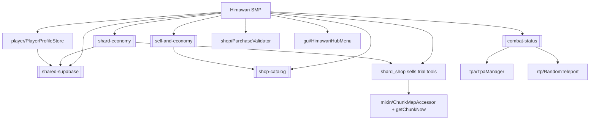

# Himawari SMP (Mod) — Architecture

Mod sub-hub of [[Himawari-System]]. Fabric Minecraft server mod (`com.survivalmod`, archives base
`survivalmod`). Java 25, Minecraft 26.2, Fabric Loom. Source (repo root since the 2026-06-24 clean):
`\\wsl.localhost\Ubuntu\home\woopsy\Project\Minecraft Bot\Himawari`.

## Repository
- Public GitHub repo: **https://github.com/Woopsyyy/Himawari.git** (`main`). On **2026-06-24** the old
  repo was deleted and this fresh one pushed as a single clean "Initial commit" — the Fabric project
  was **flattened from `…/SMP` up to the repo root**, ~18,700 committed decompiled-vanilla asset/data
  + extracted Fabric-API files were purged, and `.gitignore` rewritten for a single-mod-at-root layout
  (note the `!gradle/wrapper/gradle-wrapper.jar` keep-exception under the `*.jar` rule). 128 files now.
- **Version guard rail removed**: `fabric.mod.json` `depends.minecraft` is `>=26.2-` (was `~26.2`), so
  Fabric no longer refuses to load on newer MC versions. The build still pins `minecraft_version` in
  `gradle.properties`, so a future MC version may still need a recompile/bump — this only drops the
  runtime block.

## Build & deploy
- Build from **WSL**: `./gradlew build` (Windows git can't touch the WSL repo; use WSL git too).
  ⚠️ **Push from Windows git** though — WSL has no GitHub credentials (no `gh`/helper/token); Windows
  git uses Git Credential Manager. Disable auto-maintenance on push over the UNC mount
  (`git -c maintenance.auto=false -c gc.auto=0 push`) to avoid the multi-pack-index permission error.
- `build.gradle` `deployToMods` (finalizes `jar`) deletes old `survivalmod-*.jar` and copies the fresh
  jar into `modsDir` = `/mnt/d/Minecraft Server/HimawariSMP_1/mods` — a successful build auto-deploys.
  **Restart the server to load it.** Bump `mod_version` in `gradle.properties` per bundle (`/version`).
- Mixins in `src/main/resources/survivalmod.mixins.json`. All config/prices live in Supabase via
  `supabase/RemoteConfig` (see [[shared-supabase]]); empty/code-default fallback when unreachable.

## Entry point
`SurvivalMod.java` — `onInitialize`: builds every manager (static singletons, `SurvivalMod.shop()`,
`.economy()`, `.combat()`, …), registers the single `END_SERVER_TICK` pump (drives RTP, TPA, homes,
spawners, combat bar, trial expiry, price lore, sidebar, AFK, validator), the `AFTER_DAMAGE` combat
hook, and load/save lifecycle. Commands in `command/ModCommands.java` (Brigadier).

## Subsystem map (packages under `com/survivalmod/`)
**Economy & trade**
- `economy/` — `EconomyStore` (balances), `EconomyConfig`, `EconomyValidator` (craft-arbitrage guard).
- `shop/` — `ShopManager`, `ShopPrices`, `PriceLoreManager`, `Enchants`. → [[sell-and-economy]],
  [[shop-catalog]].
- `auction/` + `order/` — player auction house + buy-order marketplace (Supabase-backed), both with
  4-step create wizards. → [[auction-marketplace]].
- `spawner/` — custom internal-loot spawners (`Manager`/`Config`/`Nbt`/`Items`/`Store`).
- `potion/` — `PotionItems` + `PotionBuffStore` (custom 24h Haste/Speed/Strength buffs).

**Movement & teleport**
- `rtp/` — `RandomTeleport` + `RtpConfig` (per-dimension safe random TP). → [[combat-status]].
- `tpa/` — `TpaManager` (/tpa, auto-accept, combat-gated). → [[combat-status]].
- `home/` — `HomeManager`/`HomeStore`; `warp/` — `WarpStore`.
- `combat/` — `CombatTracker` (PvP tag + boss bar; gates RTP/home/TPA). → [[combat-status]].

**Items & world**
- `trial/` — time-limited enchant tools (3×3 / ore-vein / tree-fell / replant; right-click Fortune↔Silk
  toggle on the pick/shovel/ore-miner) + expiry destruction. → [[trial-item-expiry]].
- `item/` — `UnobtainableItems` (survival-obtainable filter, shared w/ anti-cheat).
- `effect/` — `NightVisionStore` (persistent night vision).

**Players & social**
- `rank/` — `Ranks`, `RankConfig`, `PermissionManager`, `TabListExtension` (ranks/perms/tab list).
- `stats/` — `StatsStore`/`PlayerStats` (kills/deaths/playtime). `player/` — `FirstJoinStore`.
- `prefs/` — `PlayerPrefs` (e.g. auto-accept TPA). `afk/` — `AfkManager`.
- `scoreboard/` — `Sidebar`, `HiddenLines`, `ScoreboardConfig`.
- `moderation/` — `MuteManager` + `BanManager` (Supabase-mirrored); `investigation/` — the /admin
  cheater board; `bounty/` — pooled PvP bounties. → [[moderation-bans]], [[admin-investigator]],
  [[bounties]].
- `link/` — `LinkManager` (in-game `/link`). `discord/` — `DiscordManager`/`Config` (mod→Discord).
- Ranks are **owner + mod** only; owner commands work with or without OP (`isOwnerSource`). Cash
  amounts accept k/m/b/t (`economy/Amounts`).

**Infra**
- `supabase/` — `SupabaseClient` (REST), `RemoteConfig` (config seam), `SupabaseRealtime` (live WS),
  `SupabaseSettings`. → [[shared-supabase]].
- `config/` — `ModConfig`, `ConfigFiles`. `command/` — `ModCommands` (Brigadier registration).
- `gui/` — ~20 chest menus (Shop, Auction, Order*, Home, Spawner, Potion, BalTop, Help, Survival,
  **HimawariHub**, **ShardShop**, Sign/Bedrock input forms).
- `mixin/` — `ChunkMapAccessor` (loaded chunks), `BaseSpawnerMixin`, `InventoryMixin`,
  `ConsumableMixin`, `AnvilMenuMixin`, `SignUpdateMixin`, `ServerPlayerTabListMixin`, **`HopperMixin`**
  (doubles hopper transfer speed).
- `util/` — `ExperienceUtil`.
- `shards/` — `ShardStore`, `ShardConfig`, `ShardRobberyStore`, `ShardShopManager` (parallel shard
  economy: persisted balances, staff robbery with 5h cooldown, shard shop with gear/trial/potions tabs).
  → [[shard-economy]].
- `player/` — `PlayerProfileStore` (skin texture caching for offline-mode player heads), `FirstJoinStore`.
- `shop/` — also includes `PurchaseValidator` (server-authoritative buy guard: per-player locks, tx IDs,
  replay protection, cooldown).

## Dependency sketch

## Related
[[Himawari-System]] · [[Himawari-Bot]] · [[shared-supabase]]
