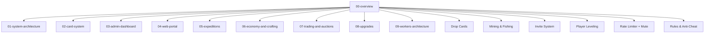

# Mythoria — Overview

**Cluster:** Mythoria
**Status:** Active
**Last updated:** 2026-07-18 (6)

## One-line summary

Medieval fantasy multiplayer Discord RPG with card collection, trading, auctions, expeditions (auto-dungeon crawler, 600 floors, 30 regions), hero upgrades/merging, crafting (80+ recipes, 8 material families, 3 gear sets, 12 tools), mining & fishing (tool-based background tick loops with durability), drop card system (public card grabbing with lock-to-numbered priority), player leveling (max 100), rate limiter & mute system, anti-cheat audit logging, and a web dashboard.

## Packages

- **MythoriaBot/** — Discord bot (Node.js 22 + TypeScript + discord.js v14)
  - 32 slash commands across 14 game systems (removed `/dropcard` duplicate, restructured `/dc`)
  - 21 services (business logic layer)
  - 7 repositories (DB query layer)
  - 8 BullMQ workers (async/background processing)
  - 1 Express dashboard server for card importing with image upload
  - Backup/restore scripts for DB + uploads
- **MythoriaWeb/** — React SPA (Vite + React 18 + TypeScript + Tailwind CSS v4)
  - Supabase Discord OAuth login
  - 4 page routes + 9 components
  - 1 Supabase Edge Function for card template import
- **Database** — Local Docker stack
  - **PostgreSQL 16** — direct connection via `pg` (node-postgres), lazy pool
  - **Redis 7** — local container (cache, cooldowns, BullMQ queue backend)
  - **Nginx** — serves static assets on port 3002 (environments, card artwork)

## Core game systems
| System | Node | Services | Commands |
|--------|------|----------|----------|
| Card System | [[02-card-system]] | CardService, ImageService | /inspect, /disassemble, /search, /kit |
| Expeditions + Battles | [[05-expeditions]] | ExpeditionService, BattleService | /explore (start/status/stop) |
| Economy & Crafting | [[06-economy-and-crafting]] | UserService, CraftingService, InventoryService | /inventory, /craft, /daily, /cd |
| Trading & Auctions | [[07-trading-and-auctions]] | TradeService, AuctionService | /trade, /auction |
| Hero Progression | [[08-upgrades]] | UpgradeService, MergeService | /upgrade, /merge |
| Admin Tools | [[03-admin-dashboard]] | Express dashboard | /importcard, /cleanup |
| Teams | [[01-system-architecture]] | TeamService | /team |
| Workers | [[09-workers-architecture]] | 6 BullMQ workers | -- |
| Drop Cards | -- | DropService | /dc, /drop cards |
| Mining & Fishing | -- | MiningService, FishingService | /mine, /fish |
| Invites | -- | InviteService | /invite |
| Notifications | -- | NotificationService, UserSettingsService | /settings |
| Player Leveling | -- | PlayerService | /stats (shows level/XP) |
| Rate Limiter + Mute | -- | RateLimiterService | (automatic) |
| Rules & Anti-Cheat | -- | audit_log table | /rules |
| Test Mode | -- | (Redis-based, no service) | /test level, /test materials, /test dropcards |

## All commands

| Command | Gate | Description |
|---------|------|-------------|
| /ping | -- | Latency, version, uptime, RAM, server count |
| /help | -- | DM guide (falls back to channel text) |
| /kit | -- | Starter kit (5 common cards) |
| /stats | dev | Profile overview with level/XP + multi-page buttons |
| /inventory | dev | Items, materials, equipment |
| /inspect | dev | Card detail + image attachment |
| /search | dev | Search heroes by name/quality/tier |
| /upgrade | -- | Queue hero quality upgrade |
| /merge | -- | Merge 2 Excellent heroes for +1 star |
| /disassemble | -- | Salvage hero for coins + essence |
| /trade | dev | Propose/cancel card trades (locked until Level 20) |
| /auction | dev | Create/bid/cancel/list/info |
| /explore | -- | Start/status/stop expedition |
| /team | -- | Create/delete/rename/add/remove/list/status |
| /craft | -- | List recipes / craft items |
| /daily | dev | Daily reward claim (+invite bonus) |
| /importcard | owner | Import card template |
| /cleanup | owner | Purge all user data |
| /wiki | -- | Item/region lookup + listings |
| /invite | -- | Create invite link, view rewards |
| /settings | -- | Toggle notification preferences |
| /cd | -- | View all cooldowns & active activities |
| /mine | -- | Start mining with team + pickaxe |
| /fish | -- | Start fishing with team + rod |
| /dc | -- | Drop 3 random cards for public grab (lock-to-numbered, 10min CD) |
| /dc list | -- | List configured drop channels |
| /drop cards | admin | Drop 3 random cards |
| /rules | -- | View server rules |
| /test level | owner | Temp level override (2hr Redis, bypasses trade/faction locks) |
| /test materials | owner | All materials 9999 qty in Redis (2hr, crafting uses test inv) |
| /test dropcards | owner | Test drop in random configured channel |
| npm run db:backup | -- | pg_dump + tar.gz uploads |
| npm run db:restore <id> | -- | Extract + restore backup |

## GRAPH METADATA
- cluster: Mythoria
- node_type: overview
- importance_level: 1.0
- hub_node: true
- tags: #mythoria #overview

