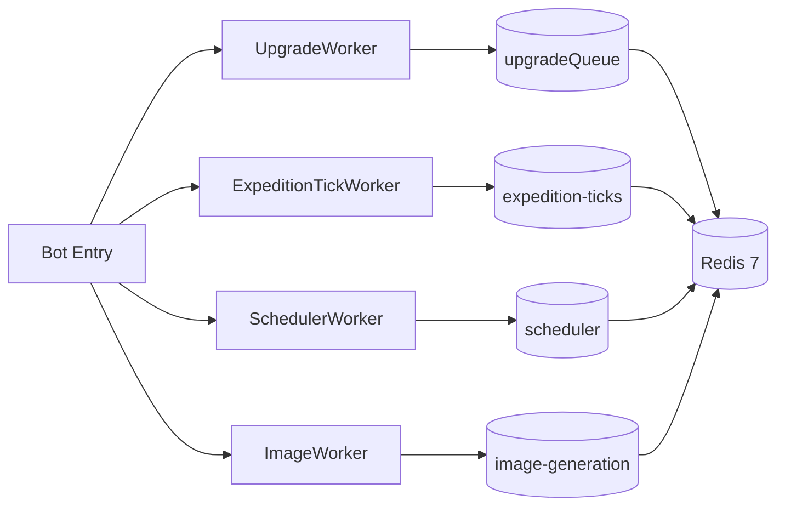

# Mythoria — Workers & Scheduler

## Architecture
BullMQ workers sharing a single local Redis 7 container. All workers are imported at bot startup in `bot/index.ts` and start listening automatically.

## 1. UpgradeWorker
**Queue:** `upgrade-queue` (concurrency 5)

**Job data:** `{ ownerId, heroId, useOrb }`

**Flow:**
1. Fetches hero + template from DB
2. Calls `UpgradeService.upgradeHero()`
3. On success: regenerates hero ID (new random identifier)
4. Sends Discord DM with embed result (success green / destroyed red / failed orange)

## 2. ExpeditionTickWorker
**Queue:** `expedition-ticks`

**Job data:** `{ teamId, ownerId }`

**Flow:**
1. Calls `ExpeditionService.processExpeditionTick()`
2. Re-throws errors for BullMQ retry logic
3. Thin delegation wrapper — all business logic in ExpeditionService

## 3. SchedulerWorker
**Queue:** `scheduler` (concurrency 1)

**Jobs:**
| Job ID | Interval | Action |
|--------|----------|--------|
| `tick` | 1h | Runs auction expiry processing; at midnight runs daily tasks (and Sunday runs weekly) |
| `daily-reset` | 24h | Placeholder for daily resets |
| `weekly-reset` | 7d | Placeholder for weekly resets |

Self-rescheduling: each tick queues the next tick via `scheduleNextTick()`.

**Active:** Auction expiry processing only. Daily/weekly reset handlers are scaffolded but empty.

## 4. ImageWorker
**Queue:** `image-generation`

**Job data:** `{ heroId, templateId }`

**Flow:**
1. Fetches hero + template from DB
2. Creates 400×600 PNG via Sharp with SVG compositing
3. Quality-based frame colours (Fine=blue, Excellent=green, Masterwork=gold, Legendary=purple, Perfect=pink)
4. SVG overlay: name, serial, quality, level, class, kingdom, tier, traits
5. Copies `template.artworkPath` to `hero.imageUrl` in database (no storage upload)

## Redis usage
| Purpose | Key Pattern | TTL |
|---------|-------------|-----|
| Inventory cache | `inventory:{ownerId}` | 60s |
| Expedition state | `expedition:{teamId}` | Until expedition ends |
| Hero cooldowns | `hero-cooldown:{heroId}` | 2h (resting after expedition) |
| Spam prevention | `explore-cooldown:{userId}` | 3s |
| Team expedition lock | `team-expedition:{teamId}` | Until expedition ends |
| BullMQ queues | `{bull:*}` | Managed by BullMQ |

## GRAPH METADATA
- cluster: Mythoria
- node_type: infrastructure
- importance_level: 0.75
- hub_node: false
- tags: #mythoria #workers #bullmq
