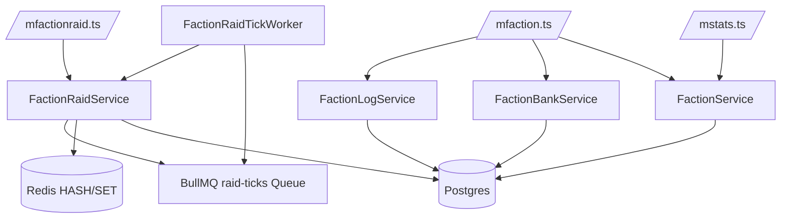

# 10 — Faction & Raid System

**Cluster:** Mythoria
**Node Type:** Feature Module
**Importance:** 0.7
**Hub Node:** false
**Tags:** `faction` `raid` `multiplayer` `tick-worker`

---

## Overview

Factions allow players to group up (max 100 members). Faction raids let up to 30 teams (150 heroes total) participate in shared exploration/mining/fishing activities over 24 hours with contribution-based loot distribution.

---

## Architecture

---

## Database Tables

- **factions** — `id`, `name` (UNIQUE), `owner_id`, `created_at`
- **faction_members** — `(faction_id, user_id)` PK, `role` (member/officer/admin), `joined_at`
- **faction_bank** — `id` PK, `faction_id`, `item_type`, `item_id` (default `__null__`), `quantity`, UNIQUE on `(faction_id, item_type, item_id)`
- **faction_raids** — `id` PK, `faction_id`, `name`, `activity_type`, `loot_mode`, `created_by`, `approved_by`, `status` (pending/ongoing/completed/stopped/declined), `started_at`, `completed_at`
- **faction_raid_teams** — `(raid_id, team_id)` PK, `user_id`, `total_power`, `ticks_survived`, `status` (alive/dead), `loot_earned` JSONB
- **faction_logs** — `id` SERIAL PK, `faction_id`, `category` (raid/bank/member), `actor_id`, `action`, `details` JSONB, `created_at`

- `users.total_power` column added (BIGINT, default 0)

---

## Redis Data

All lean data structures, no JSON blobs:
- `raid:{id}` → HASH `{ factionId, name, activityType, lootMode, status, createdBy, tickCount }`
- `raid:{id}:teams` → SET of `teamId`
- `raid:{id}:team:{teamId}` → HASH `{ userId, totalPower, ticksSurvived, status, lootJson }`
- `faction:{factionId}:raid_locks` → SET of locked `teamId`

---

## Services

| File | Key exports | Role |
|---|---|---|
| `src/services/FactionLogService.ts` | `factionLogService` | `log()`, `getLogs()` |
| `src/services/FactionService.ts` | `factionService` | CRUD, membership, total power calc |
| `src/services/FactionBankService.ts` | `factionBankService` | deposit/withdraw/transfer |
| `src/services/FactionRaidService.ts` | `factionRaidService` + `raidTickQueue` | Full raid lifecycle, tick processing, loot distribution |
| `src/workers/FactionRaidTickWorker.ts` | `raidTickWorker` | BullMQ worker consuming `raid-ticks` queue |

---

## Commands

### `/faction`
| Subcommand | Permission | Gate |
|---|---|---|
| `create <name>` | user | Level 60 + 50k total power |
| `invite <user>` | admin | Target Level 30+ |
| `leave <name> <confirm>` | member | Must type faction name |
| `kick <user>` | officer+ | |
| `role <user> <role>` | admin | |
| `stats [faction_id]` | anyone | |
| `logs` | officer+ | Category filter buttons |
| `bank transfer <user> <item_id> <qty>` | admin | |

### `/factionraid`
| Subcommand | Permission | Notes |
|---|---|---|
| `create <name> <activity> <loot>` | officer+ | Admin = ongoing, Officer = pending |
| `accept <name>` | admin | Approves pending raid |
| `decline <name>` | admin | Rejects pending raid |
| `start <name>` | admin | Starts raid |
| `stop <name>` | admin | Stops + distributes loot |
| `party join <raid_name> <team_name>` | member | Locks team into raid |
| `party leave <raid_name>` | member | Only when pending |
| `status <name>` | anyone | Shows teams/power/progress |
| `contribution <name>` | participant | Your team's earnings |

---

## Tick Mechanics

- **Interval:** 5 minutes
- **Max duration:** 24h (288 ticks)
- **Enemy generation:** Procedural by floor (scales with team power / 10), activity-specific enemy names
- **Battle:** Reuses `BattleService.resolveBattleRound()`
- **Death:** Team dies → all heroes Injured, locked for raid duration
- **Loot share:** `(teamPower × ticksSurvived) / totalContribution × pool`

---

## Limits

| Check | Value |
|---|---|
| Create | Level 60 + 50k power |
| Join | Level 30 |
| Members | 100 |
| Ongoing raids per faction | 5 |
| Teams per raid | 30 (max) |
| Heroes per team | 1-5 |
| Raid duration | 24 hours |
